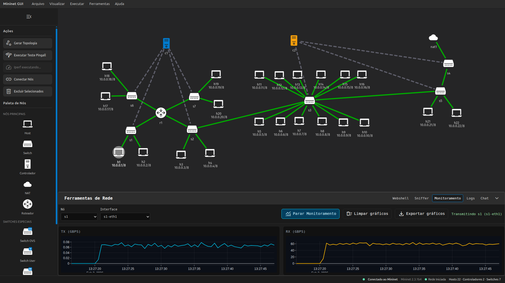

# Mininet-GUI: Uma Abordagem Visual e Interativa para Experimentacao em Redes SDN


O Mininet-GUI e uma interface web para criacao e execucao de experimentos no Mininet por meio de um grafo de topologia interativo. A aplicacao permite adicionar e configurar hosts, switches, controladores e enlaces, iniciar ou encerrar a emulacao e modificar a topologia em tempo real.
Tambem oferece terminais integrados via WebShell, gerenciamento de regras OpenFlow, analisador de pacotes com Sniffer embutido, graficos de trafego em tempo real e uma interface de chat para interagir com a topologia usando IA.

## Informacoes do projeto

Contato: Lucas Schneider <lucasschneider.dev@gmail.com>

Artigo: <https://doi.org/10.5753/sbrc_estendido.2025.7448>

Video de demonstracao: <https://youtu.be/YSsqHKsJlxY>

Repositorio oficial: <https://github.com/latarc/mininet-gui>

Maquina virtual VirtualBox: <https://drive.google.com/file/d/1aDN72tvA3mvsEMomfyqbHUGZHaCtPSOH/view?usp=sharing>

### Screenshot



## Requisitos

A VM pronta para uso requer Oracle VirtualBox (versao 7.1.6 r167084).
Memoria RAM: minimo de 8 GB para a VM.

## Nota de seguranca

A instalacao nativa do Mininet e invasiva e pode modificar ou remover arquivos importantes do sistema. Por seguranca, recomenda-se o uso da VM pronta do Mininet-GUI.

## Instalacao

### 1) Docker (recomendado para uso local)

Pre-requisitos:
- Docker
- Open vSwitch instalado e configurado no host

Build:

```bash
docker build -t mininet-gui \
  --build-arg VITE_BACKEND_URL=http://localhost:8000 \
  --build-arg VITE_BACKEND_WS_URL=ws://localhost:8000 \
  .
```

Execucao:

```bash
docker run --privileged --net=host \
  -v /var/run/openvswitch:/var/run/openvswitch \
  mininet-gui
```

Abra a interface em:
`http://localhost:5173`

### 2) Codigo-fonte

Atencao: os comandos abaixo modificam o kernel e outras configuracoes do sistema operacional. Use com cautela.
Testado em Ubuntu 20.04.

```bash
git clone https://github.com/mininet/mininet
cd mininet
./util/install.sh -nfv
cd ..
git clone https://github.com/latarc/mininet-gui
cd mininet-gui
./setup.sh
```

Instalacao opcional do Ryu:

```bash
pip3 install ryu eventlet==0.30.0 dnspython==1.16.0
```

### 3) Maquina virtual pronta (recomendado)

Pre-requisito: Oracle VirtualBox (<https://www.virtualbox.org/wiki/Downloads>)

Passo 1: Baixe o arquivo OVA: <https://drive.google.com/file/d/1aDN72tvA3mvsEMomfyqbHUGZHaCtPSOH/view?usp=sharing>

Passo 2: Importe `Mininet-GUI-VM.ova` no VirtualBox

Passo 3: Inicie a VM (usuario `mininet`, senha `mininet`)

## Teste minimo

Passo 1: Inicie a VM e faca login (usuario `mininet`, senha `mininet`)

Passo 2: Abra um terminal (Ctrl+Alt+T) e execute `mininet_gui` (ou `/home/mininet/mininet-gui/scripts/run.sh`)

Passo 3: O comando exibira uma URL, por exemplo `http://10.0.2.15:5173`. Abra esse endereco no navegador dentro da VM.

Passo 4: Crie um controlador arrastando o item "Controller" da barra lateral esquerda para o canvas. Quando o modal abrir, escolha "Default" e confirme.

Passo 5: Clique em "Generate Topology" na barra lateral. No modal, selecione "Topology Type" = Single, "Controller" = c1, defina "Hosts" = 2 e confirme.

Passo 6: Execute um teste de pingall clicando em "Run Pingall Test" e aguarde os resultados.

Passo 7 (opcional): Teste com iperf. No WebShell, abra h1 e execute `iperf -s`. Depois abra h2 e execute `iperf -c 10.0.0.1`. Aguarde cerca de 1 minuto.

Passo 8 (opcional): Multiplos controladores. Adicione um novo "Controller" com tipo "Remote", IP `127.0.0.1` e porta `6633`. Gere uma topologia Single com 2 hosts e selecione o novo controlador (c2). Conecte os switches `s1` e `s2` com "Create Link". No WebShell de `c2`, execute `ryu-manager --ofp-tcp-listen-port 6633 ryu.app.simple_switch_13` para iniciar o controlador Ryu. Em seguida, valide com Pingall.

Passo 9: Use "Export Topology (JSON)" e "Export Mininet Script" para exportar a topologia atual em JSON e como script Python do Mininet.

## Experimentos

A VM requer pelo menos 2 GB de RAM e um nucleo de CPU dedicado.

### Reivindicacao: geracao automatizada de topologias comuns

Depois de iniciar o `mininet_gui` e abrir o frontend, clique em "Generate Topology". Selecione o tipo de topologia (Single, Linear ou Tree), o numero de dispositivos e confirme.

### Reivindicacao: terminal integrado dos nos via WebShell

Depois de iniciar o `mininet_gui` e abrir o frontend, crie ao menos um no pela geracao automatica ou por arrastar e soltar. Na aba inferior "WebShell", selecione o terminal do no e execute comandos diretamente no namespace correspondente.

## Licenca

BSD 3-Clause License

Copyright (c) 2025, LaTARC Research Lab

Redistribution and use in source and binary forms, with or without
modification, are permitted provided that the following conditions are met:

1. Redistributions of source code must retain the above copyright notice, this
   list of conditions and the following disclaimer.

2. Redistributions in binary form must reproduce the above copyright notice,
   this list of conditions and the following disclaimer in the documentation
   and/or other materials provided with the distribution.

3. Neither the name of the copyright holder nor the names of its
   contributors may be used to endorse or promote products derived from
   this software without specific prior written permission.

THIS SOFTWARE IS PROVIDED BY THE COPYRIGHT HOLDERS AND CONTRIBUTORS "AS IS"
AND ANY EXPRESS OR IMPLIED WARRANTIES, INCLUDING, BUT NOT LIMITED TO, THE
IMPLIED WARRANTIES OF MERCHANTABILITY AND FITNESS FOR A PARTICULAR PURPOSE ARE
DISCLAIMED. IN NO EVENT SHALL THE COPYRIGHT HOLDER OR CONTRIBUTORS BE LIABLE
FOR ANY DIRECT, INDIRECT, INCIDENTAL, SPECIAL, EXEMPLARY, OR CONSEQUENTIAL
DAMAGES (INCLUDING, BUT NOT LIMITED TO, PROCUREMENT OF SUBSTITUTE GOODS OR
SERVICES; LOSS OF USE, DATA, OR PROFITS; OR BUSINESS INTERRUPTION) HOWEVER
CAUSED AND ON ANY THEORY OF LIABILITY, WHETHER IN CONTRACT, STRICT LIABILITY,
OR TORT (INCLUDING NEGLIGENCE OR OTHERWISE) ARISING IN ANY WAY OUT OF THE USE
OF THIS SOFTWARE, EVEN IF ADVISED OF THE POSSIBILITY OF SUCH DAMAGE.
